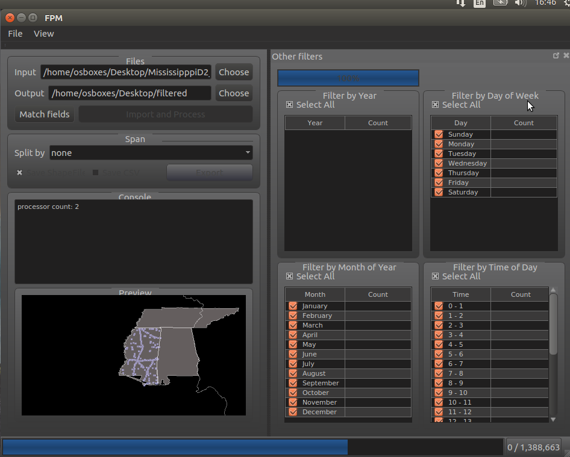
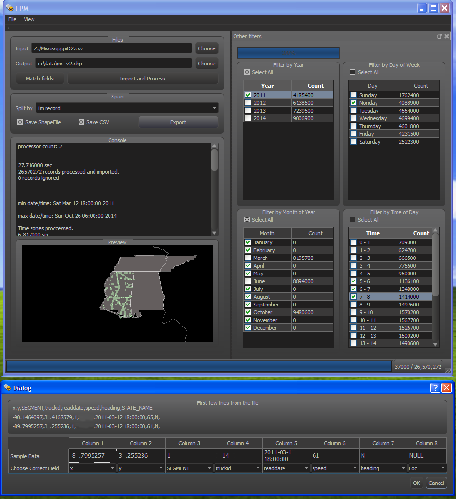

[//]: # "https://github.com/alinaimi/Freight-Performance-Measure-GIS-data-Processor"

<!---
todo:
add codes
cleanup
-->

# Freight Performance Measure GIS data Processor
Fast multi processing Freight Performance Measure GIS data Processor.

Features
=============
Can handle large 10+ GB files in seconds
Export to shape files and excel files
Local time zone processing based on location in each state.

Screen shots
=============
Linux

Max

Windows

